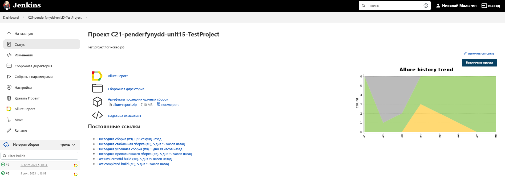
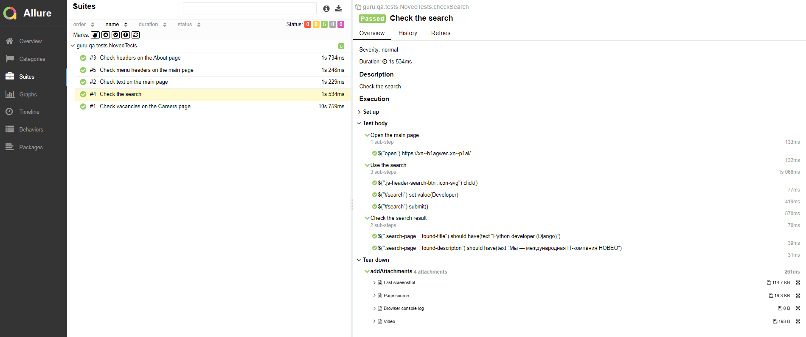
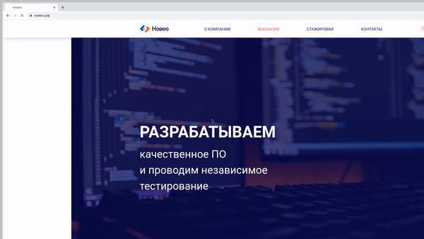

# Demo project for <a href="https://xn--b1agwec.xn--p1ai/">Noveo</a> company

## 📖 Contents:

- [Technologies and tools](#technologies-and-tools)
- [Test cases](#test-cases)
- [How to run tests from terminal](#how-to-run-tests-from-terminal)
- [How to run tests using Jenkins](#how-to-run-tests-using-jenkins)
- [Allure reports](#allure-report-example)
- [Integration with Allure TestOps](#allure-test-ops)
- [Integration with Jira](#jira)
- [Telegram notifications](#telegram-notifications)
- [Test video](#test-video)

## ⚙ <a name="tecnologies-and-tools"></a>Technologies and tools
<p align="left">
<a href="https://www.jetbrains.com/idea/"></a>
<a href="https://www.java.com/"></a>
<a href="https://github.com/"></a>
<a href="https://junit.org/junit5/"></a>
<a href="https://gradle.org/"></a>
<a href="https://selenide.org/"></a>
<a href="https://aerokube.com/selenoid/"></a>
<a href="https://github.com/allure-framework/allure2"></a>
<a href="https://qameta.io/"></a>
<a href="https://www.jenkins.io/"></a>
<a href="https://web.telegram.org/"></a>
</p>

Autotests written on <code>Java</code> using <code>Selenide</code> and <code>JUnit5</code> frameworks. Project builds from <code>IntelliJ Idea</code> with <code>Gradle</code>. Tests can be run from <code>Jenkins</code> on remote server with <code>Selenoid</code>.  

Results visualised with <code>Allure Report</code> and <code>Telegram Bot</code>.

Allure report contains:
- Test steps
- Screenshot after last step
- Page source
- Browser console logs
- Video of the test run

## ✔️ <a name="test-cases"></a>Test cases

- Check text on the main page
- Check menu headers on the main page
- Check headers on the About page
- Check vacancies on the Careers page
- Check the search

## 💻 <a name="how-to-run-tests-from-terminal"></a>How to run tests from terminal

```
gradle clean test -DselenoidHome="selenoid.autotests.cloud" -DbrowserSize="1920х1080" -Dbrowser="chrome" -DbrowserVersion="100.0"
```

Tests will be launched remotely with <code>Selenoid</code>.

## <a name="how-to-run-tests-using-jenkins"></a> How to run tests using <a href='https://jenkins.autotests.cloud/job/C21-penderfynydd-unit15-TestProject/' title="Jenkins build">Jenkins</a>

To run the tests click <code>Build with parametes</code> and then click <code>Build</code>.
<p align="center">

</p>
After build is complete, at <code>Builds history</code> you can find <code>Allure Report</code> icon, click on which will allow you to see html-report of the test run.

## <a name="allure-report-example"></a> Allure report example
### Overview

<p align="center">

</p>

### Test details

<p align="center">

</p>

## <a name="allure-test-ops"></a> Integration with <a href='https://allure.autotests.cloud/project/3672/dashboards'>Allure TestOps</a>

<p align="center">

</p>

## <a name="jira"></a> Integration with <a href='https://allure.autotests.cloud/project/3672/dashboards'>Jira</a>

<p align="center">

</p>


## <a name="telegram-notifications"></a> Telegram notifications

After test run you can receive a notification to an email of messenger of choice. For example, <code>Telegram</code>.

<p align="center">

</p>

## 🎥 <a name="test-video"></a>Test video

To every report can be attached not only screenshots, but also videos of tests.

<p align="center">
  
</p>
